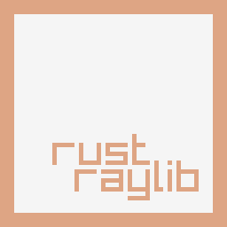

<table border="0">
<tr>
<td>



</td>
<td>

# raylib-rs

raylib-rs is a Rust binding for [raylib](http://www.raylib.com/) 5.5. It currently targets Rust toolchain version 1.78 or higher.

Please checkout the showcase directory to find usage examples!

Though this binding tries to stay close to the simple C API, it makes some changes to be more idiomatic for Rust.

</td>
</tr>
</table>

Most development happens over at: https://github.com/raylib-rs/raylib-rs


- Resources are automatically cleaned up when they go out of scope (or when `std::mem::drop` is called). This is essentially RAII. This means that "Unload" functions are not exposed (and not necessary unless you obtain a `Weak` resource using make_weak()).
- Most of the Raylib API is exposed through `RaylibHandle`, which is for enforcing that Raylib is only initialized once, and for making sure the window is closed properly. RaylibHandle has no size and goes away at compile time. Because of mutability rules, Raylib-rs is thread safe!
- A `RaylibHandle` and `RaylibThread` are obtained through `raylib::init_window(...)` or through the newer `init()` function which will allow you to `build` up some window options before initialization (replaces `set_config_flags`). RaylibThread should not be sent to any other threads, or used in a any syncronization primitives (Mutex, Arc) etc.
- Manually closing the window is unnecessary, because `CloseWindow` is automatically called when `RaylibHandle` goes out of scope.
- `Model::set_material`, `Material::set_shader`, and `MaterialMap::set_texture` methods were added since one cannot set the fields directly. Also enforces correct ownership semantics.
- `Font::from_data`, `Font::set_chars`, and `Font::set_texture` methods were added to create a `Font` from loaded `CharInfo` data.
- `SubText` and `FormatText` are omitted, and are instead covered by Rust's string slicing and Rust's `format!` macro, respectively.

# Installation

## Supported Platforms

| API    | Windows            | Linux              | macOS              | Web                | Android | 
| ------ | ------------------ | ------------------ | ------------------ | --------------     | ------- |
| core   | :heavy_check_mark: | :heavy_check_mark: | :heavy_check_mark: | :heavy_check_mark: | :x:     |
| rgui   | :heavy_check_mark: | :heavy_check_mark: | :heavy_check_mark: | ❔                 | :x:     |
| physac | :construction:     | :construction:     | :construction:     | ❔                 | :x:     |
| rlgl   | :heavy_check_mark: | :x:                | :x:                | ❔                 | :x:     |

## Build Dependencies

Requires glfw, cmake, and curl. Tips on making things work smoothly on all platforms is appreciated.
Follow instructions for building raylib for your platform [here](https://github.com/raysan5/raylib/wiki)

1. Add the dependency to your `Cargo.toml`:

```toml
[dependencies]
raylib = { version = "5.5" }
```

2. Start coding!

```rust
use raylib::prelude::*;

fn main() {
    let (mut rl, thread) = raylib::init()
        .size(640, 480)
        .title("Hello, World")
        .build();

    while !rl.window_should_close() {
        let mut d = rl.begin_drawing(&thread);

        d.clear_background(Color::WHITE);
        d.draw_text("Hello, world!", 12, 12, 20, Color::BLACK);
    }
}
```

### NixOS

To use raylib-rs on NixOS there's a provided nix-shell file `shell.nix` at the root of the repo that should get you up and running, which can be used like so:

`nix-shell ./shell.nix`

You'll also need to enable the Wayland feature on the raylib crate: 

`cargo add raylib -F wayland`

Contributions are welcome to improve or fix the shell.nix!

# Tech Notes

- Structs holding resources have RAII/move semantics, including: `Image`, `Texture2D`, `RenderTexture2D`, `Font`, `Mesh`, `Shader`, `Material`, and `Model`.
- `Wave`, `Sound`, `Music`, and `AudioStream` have lifetimes bound to `AudioHandle`. 
- Functions dealing with string data take in `&str` and/or return an owned `String`, for the sake of safety. The exception to this is the gui draw functions which take &CStr to avoid per frame allocations. The `rstr!` macro helps make this easy.
- In C, `LoadFontData` returns a pointer to a heap-allocated array of `CharInfo` structs. In this Rust binding, said array is copied into an owned `Vec<CharInfo>`, the original data is freed, and the owned Vec is returned.
- In C, `LoadDroppedFiles` returns a pointer to an array of strings owned by raylib. Again, for safety and also ease of use, this binding copies said array into a `Vec<String>` which is returned to the caller.
- I've tried to make linking automatic, though I've only tested on Windows 10, Ubuntu, and MacOS 15. Other platforms may have other considerations.
- OpenGL 3.3, 2.1, and ES 2.0 may be forced via adding `["opengl_33"]`, `["opengl_21"]` or `["opengl_es_20]` to the `features` array in your Cargo.toml dependency definition.

## Building from source

1. Clone repository: `git clone --recurse-submodules`
2. `cargo build`

### If building for Wayland on Linux

3. Install these packages:  
`libglfw3-dev wayland-devel libxkbcommon-devel wayland-protocols wayland-protocols-devel libecm-dev`
###### Note that this may not be a comprehensive list, please add details for your distribution or expand on these packages if you believe this to be incomplete.

4. Enable wayland by adding `features=["wayland"]` to your dependency definition

## Cross-compiling using `cross`

Cross compiling with raylib-rs can be made easier with cross. [See more on the wiki](https://github.com/raylib-rs/raylib-rs/wiki/Cross%E2%80%90compiling-using-cross)

# Extras

- In addition to the base library, there is also a convenient `ease` module which contains various interpolation/easing functions ported from raylib's `easings.h`, as well as a `Tween` struct to assist in using these functions.
- Equivalent math and vector operations, ported from `raymath.h`, are `impl`ed on the various Vector and Matrix types. Operator overloading is used for more intuitive design.

# Testing

The raylib-test crate tests the bindings by opening a window, and checking the results of various functions. It requires nightly to use.

# Contribution & Support

All contributions are welcome. Chat about raylib on [discord](https://discord.gg/VkzNHUE)
