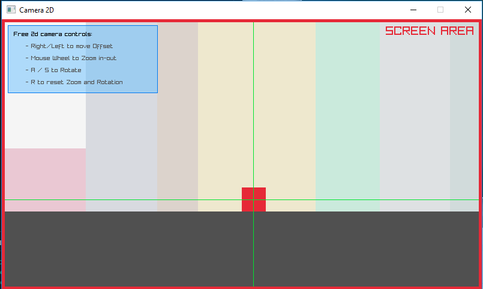
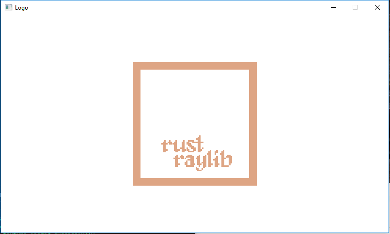
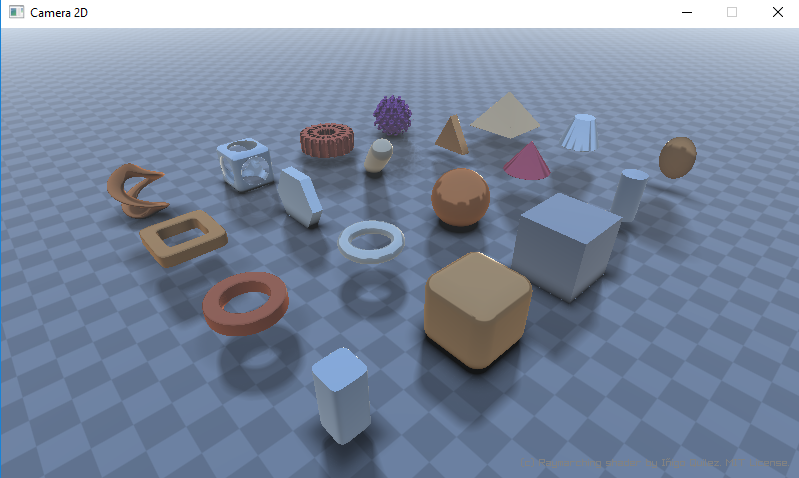
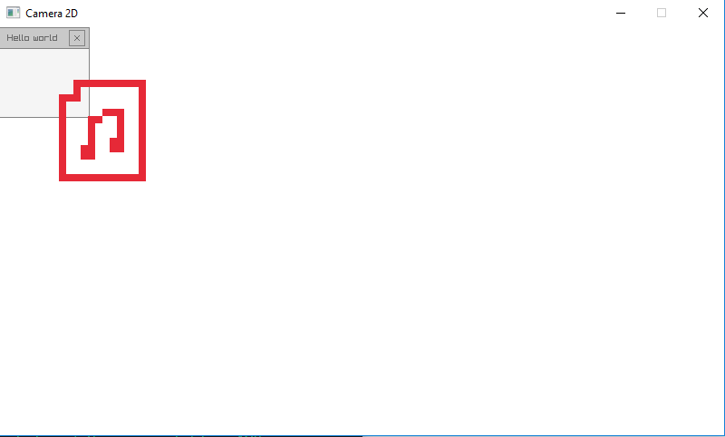
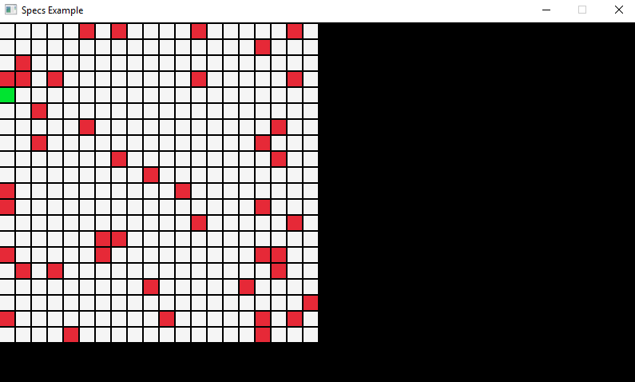
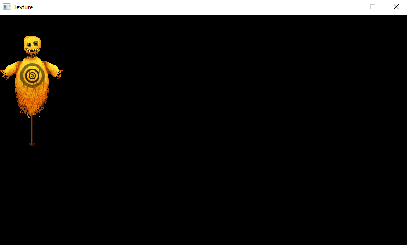
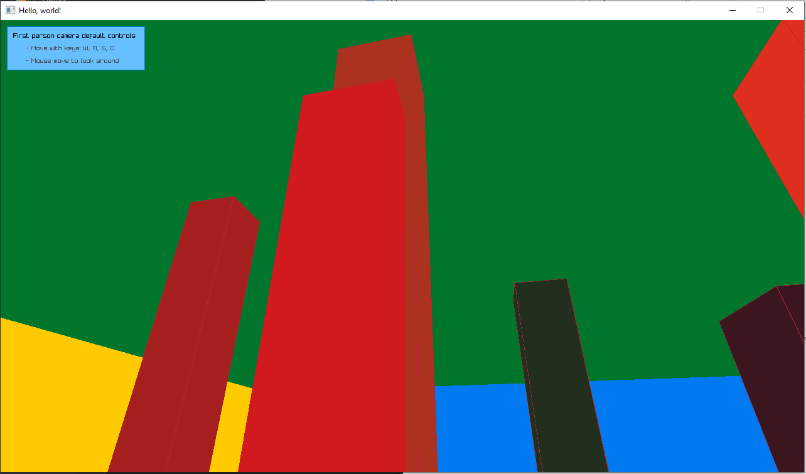
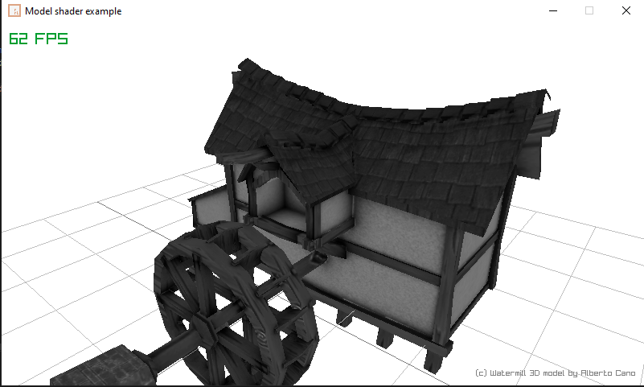
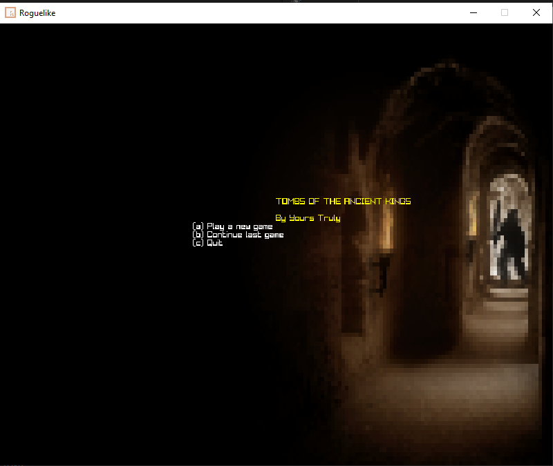

cd into the samples folder before running samples!

[arkanoid](arkanoid.rs)

[camera2D](camera2D.rs)

[font](font.rs)

[logo](logo.rs)

[raymarch](raymarch.rs)

[rgui](rgui.rs)

[specs](specs.rs)

[texture](texture.rs)

[3d_camera_first_person](3d_camera_first_person.rs)

[model_shader](model_shader.rs)

[roguelike](roguelike.rs)

[yaw_pitch_roll](yaw_pitch_roll.rs)

